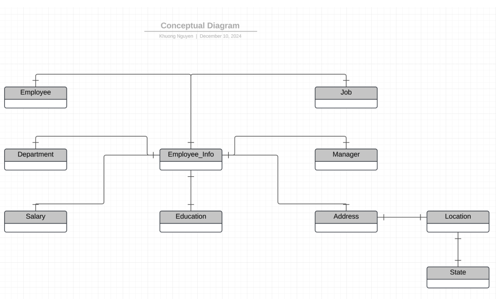

# Design for HR Database

### Project Overview

Tech ABC Corp saw explosive growth with a sudden appearance onto the gaming scene with their new AI-powered video game console. As a result, they have gone from a small 10 person operation to  200 employees and 5 locations in under a year. HR is having trouble keeping up with the growth, since they are still maintaining employee information in a spreadsheet. While that worked for ten  employees, it has becoming increasingly cumbersome to manage as the company expands.

As such, the HR department has inquired about a design for a database capable of managing their employee information.

### Dataset

The dataset is an Excel workbook which consists of 206 records, with eleven columns. The data is in human readable format, and has not been normalized at all. The data lists the names of employees at Tech ABC Corp as well as information such as job title, department, manager's name, hire date, start date, end date, work location, and salary.

### Proposed Design

##### Conceptual Design

##### Logical Design

##### Physcical Design

### Directory structure

hr_database
├── Database_Solution_Proposal.pdf: Proposal
├── README.md: Instruction
├── StageTableLoad.sql: Flat file to load data to the database
├── crud
│   ├── question1.sql
│   ├── question2.sql
│   ├── question3.sql
│   ├── question4.sql
│   ├── question5.sql
│   └── question6.sql
├── ddl
│   ├── address.sql
│   ├── department.sql
│   ├── education.sql
│   ├── employee.sql
│   ├── employee_info.sql
│   ├── job.sql
│   ├── location.sql
│   ├── manager.sql
│   ├── salary.sql
│   └── state.sql
├── hr-dataset.xlsx: Original dataset
└── img
    ├── conceptual_design.png
    ├── logical_design.png
    └── physical_design.png
